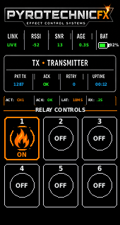

# PyrotechnicFX T190 RF Relay Controller

A custom six-channel LoRa relay-control system for a pair of **Heltec Vision Master T190** devices. One T190 acts as the handheld transmitter and the second acts as the receiver that drives six external relay-board inputs.

The project includes separate transmitter and receiver PlatformIO firmware, native 170×320 PyrotechnicFX interfaces, momentary channel control, acknowledgments, RF telemetry, communication-loss failsafe behavior, serial diagnostics, and Windows batch files for automated building and flashing.

> **Confirmed stable baseline: v1.6.3**



## Capabilities

### Transmitter

- Six independent momentary control channels
- Immediate local relay-state graphics
- Latest-state-wins RF transmission behavior
- Receiver acknowledgments
- Live link status, RSSI, SNR, packet age, latency, packet count, errors, uptime, and power status
- Fast taps, long holds, and repeated presses
- Detailed 115200-baud serial diagnostics

### Receiver

- Six GPIO relay-control outputs
- Valid packet processing and acknowledgment
- Immediate output state changes before UI/logging work
- Communication-loss failsafe that returns outputs to the safe OFF state
- Cooperative RF worker introduced in v1.6.3 to prevent ESP32-S3 CPU 0 watchdog resets
- Independent display rendering and RF/output processing

### Display interface

- Native 170×320 PyrotechnicFX graphics
- Branded transmitter and receiver boot screens
- Live boot initialization messages
- Six relay cards with a clean flame icon for active channels
- RF telemetry and status panels
- Hidden screen assembly to avoid incomplete progressive drawing

## Stable v1.6.3 receiver fix

Earlier receiver firmware could allow the `pfx-rx-radio` task to monopolize CPU 0 and starve `IDLE0`, causing a task-watchdog reset. v1.6.3 makes the receiver worker cooperative and watchdog-safe.

Expected receiver startup marker:

```text
PyrotechnicFX T190 Receiver v1.6.3
Cooperative RF worker + watchdog-safe CPU0 scheduling
[READY] watchdog-safe RX worker; waiting for authenticated control packets
```

## Repository layout

```text
PyrotechnicFX-T190-RF-Controller/
├── 1_FLASH_TRANSMITTER.bat
├── 2_FLASH_RECEIVER.bat
├── 3_BUILD_TRANSMITTER_ONLY.bat
├── 4_BUILD_RECEIVER_ONLY.bat
├── README.md
├── LICENSE
├── SERIAL-DIAGNOSTICS.txt
├── transmitter/
└── receiver/
```

`transmitter` and `receiver` are separate PlatformIO projects.

## Hardware

- 2× Heltec Vision Master T190
- Suitable antennas for the configured frequency
- USB data cables
- Six momentary transmitter inputs
- External relay board or input-driver hardware
- Separate regulated relay-board supply
- Wiring, connectors, enclosure, fusing, and independent safety controls

## Current receiver outputs

| Channel | GPIO |
|---|---:|
| Relay 1 | GPIO 1 |
| Relay 2 | GPIO 2 |
| Relay 3 | GPIO 3 |
| Relay 4 | GPIO 4 |
| Relay 5 | GPIO 15 |
| Relay 6 | GPIO 16 |

The GPIO pins are control signals only. Do not power relay coils directly from a T190 GPIO or its 3.3-volt output.

## Easy Windows build and flash

The root batch files automate dependency repair, PlatformIO compilation, device erasing, firmware uploading, and optional serial monitoring.

### 1. Flash the receiver first

1. Connect the receiver T190 using a USB data cable.
2. Close other programs using its COM port.
3. Double-click:

```text
2_FLASH_RECEIVER.bat
```

4. Follow the prompts in the terminal.
5. Leave the receiver powered after flashing.

### 2. Flash the transmitter

1. Connect the transmitter T190.
2. Double-click:

```text
1_FLASH_TRANSMITTER.bat
```

3. Follow the prompts.

### Build without uploading

```text
3_BUILD_TRANSMITTER_ONLY.bat
4_BUILD_RECEIVER_ONLY.bat
```

### Project-specific full-flash scripts

```text
transmitter/FULL_FLASH_TRANSMITTER.bat
receiver/FULL_FLASH_RECEIVER.bat
```

### Serial monitor

Choose **115200 baud** when prompted.

## Manual PlatformIO method

Install:

- Visual Studio Code
- PlatformIO extension
- Git for Windows
- Compatible USB serial driver

Clone the repository:

```bash
git clone https://github.com/jamesgbahr/PyrotechnicFX-T190-RF-Controller.git
cd PyrotechnicFX-T190-RF-Controller
```

Build and flash the receiver:

```bash
cd receiver
pio run
pio run -t erase
pio run -t upload
```

Leave the receiver powered. Then open the transmitter project and run:

```bash
cd ../transmitter
pio run
pio run -t erase
pio run -t upload
```

Open the serial monitor:

```bash
pio device monitor -b 115200
```

## Basic test procedure

1. Disconnect relays, valves, solenoids, igniters, fuel, and effect hardware.
2. Use LEDs or a logic analyzer on the receiver outputs.
3. Flash and power the receiver.
4. Confirm the v1.6.3 watchdog-safe startup marker.
5. Flash and power the transmitter.
6. Confirm the transmitter changes from `WAIT` to `LIVE`.
7. Confirm RSSI and SNR appear after valid acknowledgment traffic.
8. Test all channels with quick taps and long holds.
9. Confirm every output turns off immediately on release.
10. Turn off the transmitter and confirm the receiver failsafe clears all outputs.

## Relay-board power

Use a separate regulated supply appropriate for the relay board:

```text
T190 GPIO        → relay-board input
T190 GND         → relay-board control ground
External supply  → relay-board power input
```

Confirm that the relay-board input stage accepts 3.3-volt logic. Some modules require a transistor, MOSFET, level shifter, or correctly wired optocoupler interface.

## Troubleshooting

### Transmitter remains on WAIT

- Confirm the receiver is powered.
- Confirm both devices use matching firmware and RF settings.
- Confirm antennas are connected.
- Review the receiver serial monitor for radio or packet errors.

### RSSI and SNR remain blank

These values appear after a valid control packet and receiver acknowledgment exchange. Blank values generally mean the link has not completed that exchange.

### Receiver repeatedly reboots

Confirm it identifies itself as v1.6.3 and prints:

```text
Cooperative RF worker + watchdog-safe CPU0 scheduling
```

### Relay board does not trigger

Check active-HIGH versus active-LOW behavior, separate board power, common ground, 3.3-volt input compatibility, jumper settings, and GPIO assignments.

## Planned expansion

- Eight-channel receiver support
- Configurable pin mapping and channel names
- Pairing and device IDs
- Configurable LoRa settings
- Adjustable failsafe timing
- Enclosure and XLR panel files for 3D printing
- Battery calibration and additional telemetry

## Safety

This is experimental control firmware. Bench-test with LEDs or a logic analyzer before connecting relay loads or production equipment.

Use independent physical safety systems appropriate to the application, including hardwired emergency stop, master output disable, power or fuel shutoff, correct fusing, electrical isolation, and qualified operation. Software and wireless communication must never be the only safety layer.

## License

Copyright © 2026 PyrotechnicFX / James Bahr. See [LICENSE](LICENSE) for usage terms.
